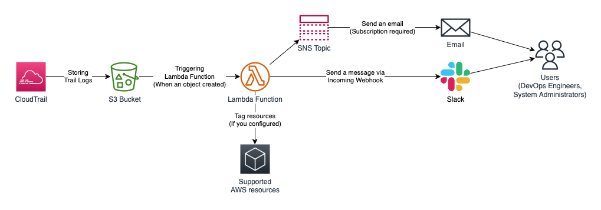

# CloudTrail Watcher

한국어 버전: [README.ko.md](./README.ko.md)

When a resource like EC2, S3, and Lambda was created...

* You can be notified via Slack message(using Incoming Webhook) or email(using Amazon SNS). 
* CloudTrail Watcher Lambda Function will create `User` tag on your AWS resources automatically.

## Architecture

## Supported AWS Resources & Actions

* Console Login
* IAM (User, Group, Role, Policy, Instance Profile)
* EC2 (Instance, Security Group (Creating security group, Adding/Removing/Modifying rules))
* RDS (Cluster, Instance)
* S3 (Bucket)
* ElastiCache (Redis, Memcached)
* EMR (Cluster)
* Lambda (Function)
* Redshift (Cluster)
* ECS (Cluster)
* EKS (Cluster)
* DocumentDB (Cluster, Instance)
* MSK(Managed Streaming for Apache Kafka) (Cluster)
* MWAA(Managed Workflow for Apache Airflow) (Environment)
* DynamoDB (Table)
* ELB (CLB, ALB, NLB, GLB)
* CloudFront (Distribution)
* ECR (Repository)
* SNS (Topic)
* SQS (Queue)

## Deploy Infrastructures

This application includes a Lambda Layer and a IAM Policy for the layer. You can choose the method to deploy these resources. 

### Deploy with SAM (Serverless Application Model)

You can deploy this application included additional resources with SAM. Please refer `deploy/sam/template-with-layer.yaml` file.

Because of the limitation of SAM and CloudFormation, You can only deploy this application with new CloudTrail and S3 bucket.

### Deployment options (SAM Template Parameters)

| Name | Description | Type | Default | Required |
|------|-------------|------|---------|----------|
| ResourcesDefaultPrefix | Prefix for resources related with CloudTrail Watcher (If not set, 'cloudtrailwatcher-<YOUR_ACCOUNT_ID>') | string | "" | no |
| SlackWebhookURL | Slack Webhook URL (set "DISABLED" to disable) | string | "DISABLED" | no |
| SetMandatoryTag | Make 'User' tags when resources are created. If you want to enable this feature, set this variable "True" | string | "False" | no |
| DisableAutoscalingAlarm | Ignore alarm for resources created by autoscaling. If you want to enable this feature, set this variable "True" | string | "False" | no |

### Deploy with Terraform

You can deploy this application included additional resources with Terraform. Please refer Terraform module: [terraform-aws-cloudtrail-watcher](https://github.com/rubysoho07/terraform-aws-cloudtrail-watcher)

## References

* [CloudTrail Log Event Reference](https://docs.aws.amazon.com/awscloudtrail/latest/userguide/cloudtrail-event-reference.html)